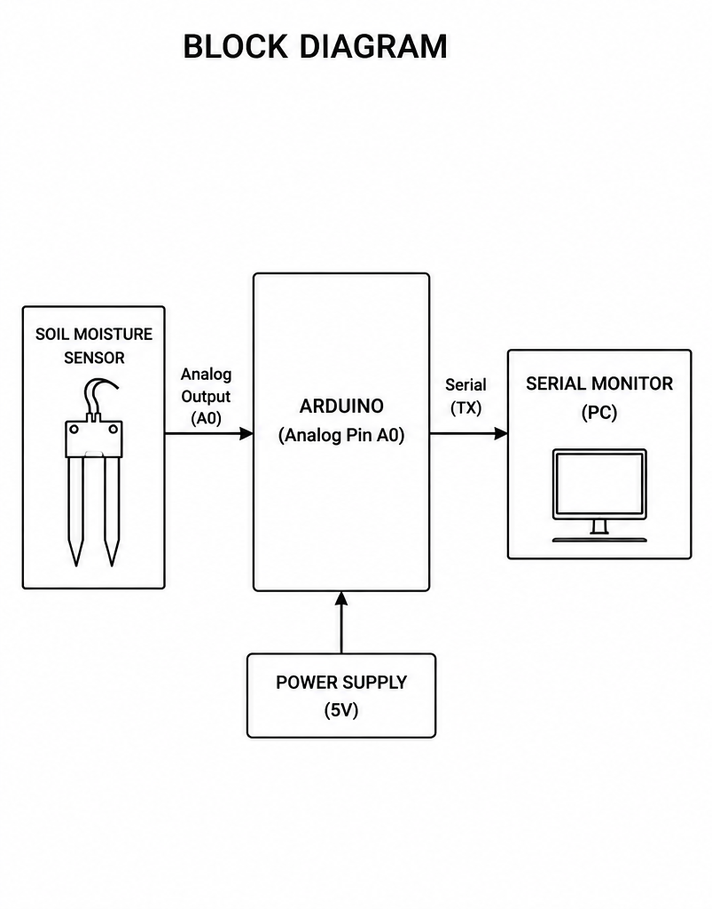
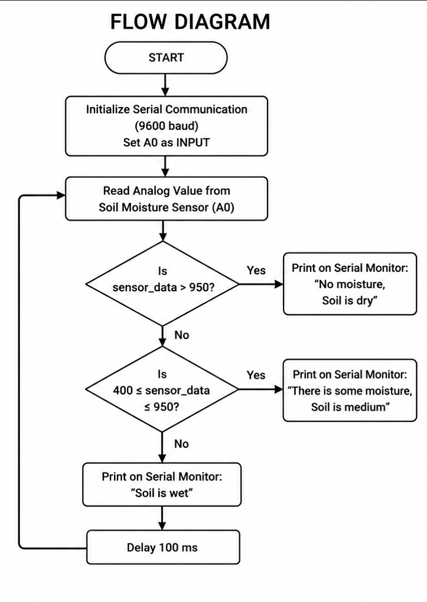

# Real-Time Soil Moisture Monitoring and Smart Irrigation System using Arduino

## Overview

The **Real-Time Soil Moisture Monitoring and Smart Irrigation System** is an Arduino-based project designed to monitor the moisture content of soil using a soil moisture sensor. The sensor continuously measures the moisture level and sends analog data to the Arduino Uno. Based on predefined threshold values, the system classifies the soil as **Dry**, **Medium Moisture**, or **Wet** and displays the result on the Arduino Serial Monitor.

This project demonstrates the basics of sensor interfacing, analog data processing, and real-time monitoring, making it suitable for smart agriculture and beginner IoT applications.

---

## Objectives

- Monitor soil moisture levels in real time.
- Detect dry, medium, and wet soil conditions.
- Learn analog sensor interfacing with Arduino.
- Understand the fundamentals of smart agriculture systems.
- Display soil condition through the Arduino Serial Monitor.

---

# Features

- Real-time soil moisture monitoring
- Analog sensor data acquisition
- Simple threshold-based soil classification
- Serial Monitor output
- Easy to build and understand
- Beginner-friendly Arduino project
- Low-cost hardware implementation

---

# Components Required

| Component | Quantity |
|-----------|----------|
| Arduino Uno | 1 |
| Soil Moisture Sensor | 1 |
| USB Cable | 1 |
| Jumper Wires | As Required |
| Computer/Laptop | 1 |

---

# Software Requirements

- Arduino IDE
- Arduino Uno Board Package
- USB Driver (if required)

---

# Circuit Connections

| Soil Moisture Sensor | Arduino Uno |
|----------------------|-------------|
| VCC | 5V |
| GND | GND |
| AO | A0 |

---

# Project Images

## Block Diagram



---

## Flow Diagram



---

# Working Principle

1. The Arduino initializes serial communication at **9600 baud rate**.
2. The soil moisture sensor measures the moisture content of the soil.
3. Arduino reads the analog value from **A0**.
4. The sensor value is compared with predefined threshold values.
5. The soil condition is determined as:
   - Dry Soil
   - Medium Moisture
   - Wet Soil
6. The result is displayed on the Serial Monitor.
7. The process repeats every **100 milliseconds**.

---

# Threshold Values

| Sensor Value | Soil Condition |
|--------------|----------------|
| Greater than 950 | 🌵 Dry Soil |
| 400 to 950 | 🌿 Medium Moisture |
| Less than 400 | 💧 Wet Soil |

---

# Sample Output

```text
Sensor_data:986 | No moisture, Soil is dry

Sensor_data:742 | There is some moisture, Soil is medium

Sensor_data:315 | Soil is wet
```

---

# Project Structure

```text
Soil-Moisture-Detection-System/
│
├── README.md
├── Soil_Moisture_Detection.ino
│
└── images/
    ├── block_diagram.png
    └── flow_diagram.png
```

---

# Applications

- Smart Agriculture
- Precision Farming
- Automatic Irrigation Systems
- Greenhouse Monitoring
- Home Gardening
- Plant Health Monitoring
- Educational Arduino Projects

---

# Advantages

- Simple and easy to implement
- Low-cost hardware
- Real-time soil monitoring
- Low power consumption
- Easy to modify and upgrade
- Suitable for beginners

---

# Limitations

- Threshold values may vary depending on soil type.
- Requires manual monitoring through the Serial Monitor.
- Does not automatically control irrigation.
- Sensor performance may reduce over long-term use.

---

# Future Enhancements

- Automatic Water Pump Control
- LCD/OLED Display Integration
- ESP8266/ESP32 Wi-Fi Connectivity
- IoT Cloud Monitoring
- Mobile Application Integration
- Blynk Dashboard
- ThingSpeak Data Logging
- SMS/Email Alerts
- AI-based Soil Analysis

---

# Technologies Used

- Arduino Uno
- Embedded C/C++
- Arduino IDE
- Soil Moisture Sensor
- Serial Communication

---

# Author

**Lalithambigai Kathiresan**

Bachelor of Engineering (Computer Science and Engineering)

Aspiring Software Engineer

---

# License

This project is developed for educational and learning purposes. 

---
